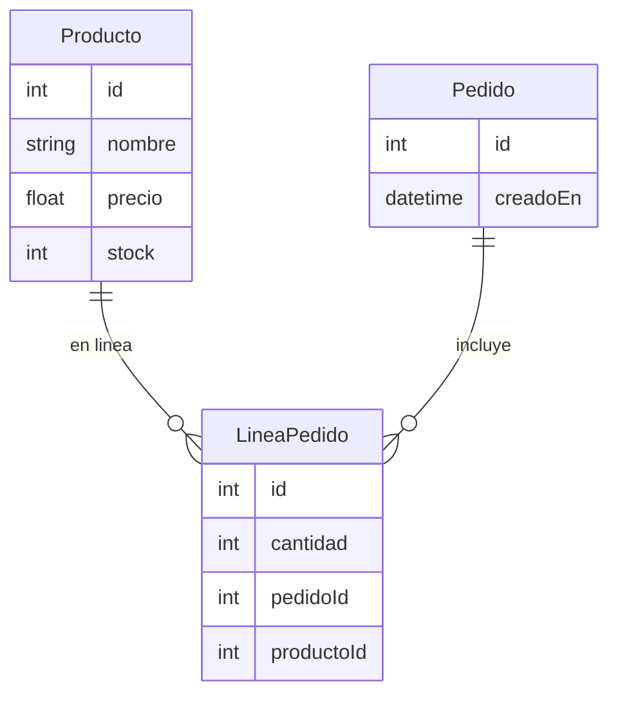

Antes de escribir tablas en el ordenador, conviene **dibujar el modelo**: qué “cosas” guardas y cómo se relacionan. Eso es un **diagrama entidad-relación** (ER): entidades (tablas futuras), atributos (columnas) y relaciones (quién apunta a quién).

Piensa en un **POS muy pequeño** (_point of sale_, punto de venta): registras **productos**, cobras **pedidos** y cada pedido lleva **líneas** (qué producto, cuántas unidades). No hace falta un ERP completo: tres ideas bastan para practicar bien.

## Tres entidades mínimas

**Producto** — lo que vendes: nombre, precio, stock aproximado.

**Pedido** — una venta concreta: cuándo se creó (y más adelante podrías añadir cliente, estado, etc.).

**Línea de pedido** — el detalle: este pedido incluye tantas unidades de tal producto. Es la tabla que **enlaza** pedido y producto (relación muchos a muchos resuelta con una tabla intermedia).

## Relaciones en una frase

- Un **pedido** tiene **muchas líneas**.
- Cada **línea** pertenece a **un pedido** y a **un producto**.
- Un **producto** puede aparecer en **muchas líneas** (en distintos pedidos).

El diagrama ER resume lo mismo: cabecera (`Pedido`), catálogo (`Producto`) y el detalle (`LineaPedido`) que conecta ambos.



## Vista en texto (referencia rápida)

Si no pudieras ver el diagrama, la idea es la misma que este esquema:

```txt
  Producto                 Pedido              LineaPedido
  ---------                ------              -------------
  id                       id                  id
  nombre                   creadoEn            cantidad
  precio                                       pedidoId    --> Pedido
  stock                                        productoId --> Producto
```

## Por qué este ejemplo sirve

Es **pequeño** pero **real**: casi todo software de ventas replica esta forma (cabecera + líneas). Cuando pases a Prisma, cada entidad del diagrama será un `model` en `schema.prisma` y las líneas del ER serán relaciones y claves foráneas. Más adelante harás el CRUD primero sobre **productos**, que es lo más directo para practicar lectura y escritura en base de datos.
