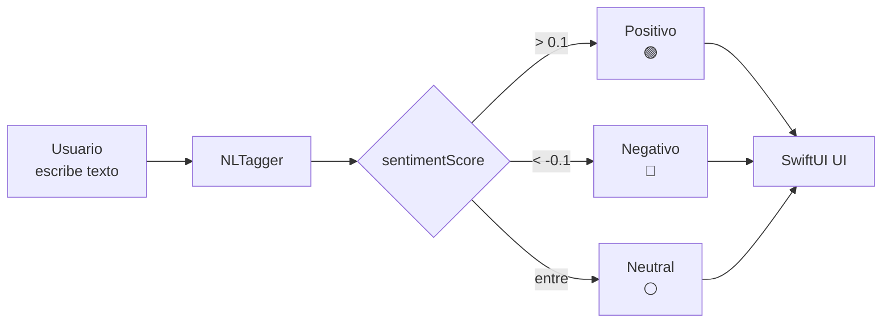

En esta demo crearás una app que analiza el sentimiento de cualquier texto en español, inglés u otros idiomas soportados. Usaremos `NLTagger` con el esquema `.sentimentScore`: una API de una sola línea que devuelve un valor entre -1.0 (muy negativo) y 1.0 (muy positivo).

## Arquitectura de la demo

La app tiene un campo de texto, un botón de análisis y una visualización del resultado con color (rojo para negativo, verde para positivo, gris para neutral).



_Flujo de análisis: el texto pasa por NLTagger y se clasifica según el rango del score de sentimiento._

```swift
import SwiftUI
import NaturalLanguage

struct SentimentAnalysisView: View {
    @State private var inputText: String = ""
    @State private var sentiment: SentimentResult = .neutral
    
    enum SentimentResult: Equatable {
        case neutral
        case positive(Double)
        case negative(Double)
        
        var label: String {
            switch self {
            case .neutral: return "Neutral"
            case .positive(let score): return "Positivo (\(String(format: "%.2f", score)))"
            case .negative(let score): return "Negativo (\(String(format: "%.2f", score)))"
            }
        }
        
        var color: Color {
            switch self {
            case .neutral: return .gray
            case .positive: return .green
            case .negative: return .red
            }
        }
    }
    
    var body: some View {
        VStack(spacing: 24) {
            Text("Análisis de sentimientos")
                .font(.largeTitle)
                .fontWeight(.bold)
            
            TextEditor(text: $inputText)
                .frame(height: 120)
                .padding(8)
                .background(Color(.systemGray6))
                .cornerRadius(12)
                .overlay(
                    RoundedRectangle(cornerRadius: 12)
                        .stroke(Color(.systemGray4), lineWidth: 1)
                )
            
            Button(action: analyze) {
                Label("Analizar", systemImage: "text.bubble.magnifyingglass")
                    .font(.headline)
                    .frame(maxWidth: .infinity)
                    .padding()
                    .background(Color.accentColor)
                    .foregroundColor(.white)
                    .cornerRadius(12)
            }
            
            HStack(spacing: 12) {
                Circle()
                    .fill(sentiment.color)
                    .frame(width: 16, height: 16)
                Text(sentiment.label)
                    .font(.title2)
                    .fontWeight(.semibold)
            }
            .padding(.vertical, 16)
            .padding(.horizontal, 24)
            .background(sentiment.color.opacity(0.15))
            .cornerRadius(12)
            
            Spacer()
        }
        .padding()
    }
    
    func analyze() {
        guard !inputText.isEmpty else {
            sentiment = .neutral
            return
        }
        
        let tagger = NLTagger(tagSchemes: [.sentimentScore])
        tagger.string = inputText
        
        let (tag, _) = tagger.tag(at: inputText.startIndex, unit: .paragraph, scheme: .sentimentScore)
        let score = Double(tag?.rawValue ?? "0") ?? 0.0
        
        if score > 0.1 {
            sentiment = .positive(score)
        } else if score < -0.1 {
            sentiment = .negative(score)
        } else {
            sentiment = .neutral
        }
    }
}
```

`SentimentAnalysisView.swift`

## Cómo interpretar el score

`NLTagger` devuelve un `NLTag` cuyo `rawValue` es un string numérico. No es un enum, así que debes convertirlo a `Double`.

| Rango de score | Interpretación |
|---|---|
| `1.0` | Muy positivo |
| `0.1 ... 1.0` | Positivo |
| `-0.1 ... 0.1` | Neutral |
| `-1.0 ... -0.1` | Negativo |
| `-1.0` | Muy negativo |

## Variante: análisis por oración

Si necesitas granularidad mayor, itera por oraciones en lugar de analizar todo el texto como un único párrafo.

```swift
func analyzeBySentences(_ text: String) -> [(String, Double)] {
    let tagger = NLTagger(tagSchemes: [.sentimentScore])
    tagger.string = text
    
    var results: [(String, Double)] = []
    tagger.enumerateTags(in: text.startIndex..<text.endIndex, unit: .sentence, scheme: .sentimentScore, options: []) { tag, range in
        let sentence = String(text[range])
        let score = Double(tag?.rawValue ?? "0") ?? 0.0
        results.append((sentence, score))
        return true
    }
    return results
}
```

`SentenceAnalyzer.swift`

Esta variante es útil para resúmenes de reseñas largas o para detectar qué parte de un mensaje cambia de tono.

## Variante: detección de idioma automática

Antes de analizar el sentimiento, puedes detectar el idioma del texto. Esto permite mostrar etiquetas localizadas o elegir modelos específicos si más adelante usas Core ML.

```swift
func detectLanguage(for text: String) -> String? {
    let tagger = NLTagger(tagSchemes: [.language])
    tagger.string = text
    let (tag, _) = tagger.tag(at: text.startIndex, unit: .paragraph, scheme: .language)
    return tag?.rawValue // "es", "en", "fr", etc.
}
```

`LanguageDetector.swift`

## Puntos clave para el hackathon

- **Idiomas soportados**: el análisis de sentimiento funciona mejor en inglés, pero también soporta español y otros idiomas principales. Prueba con frases de tu dominio antes de la demo final.
- **Privacidad total**: el texto nunca sale del dispositivo. Esto es ideal para apps de salud mental, diarios personales o feedback interno.
- **Combinación con Foundation Models**: si el score es neutral pero el texto es largo, puedes pasar el texto a un `LanguageModelSession` para un análisis más profundo (ver demo de Foundation Models).

## Recursos relacionados

- [Documentación de NaturalLanguage](https://developer.apple.com/documentation/naturallanguage/)
- [NLTagger](https://developer.apple.com/documentation/naturallanguage/nltagger)
- [NLTag](https://developer.apple.com/documentation/naturallanguage/nltag)
